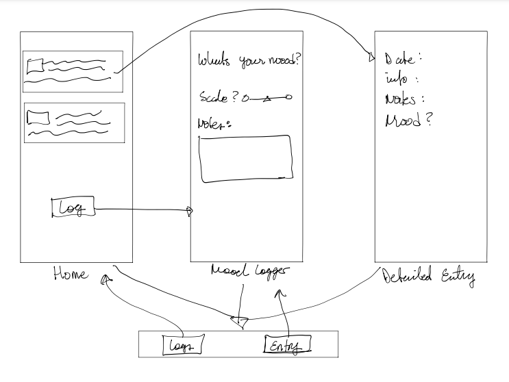
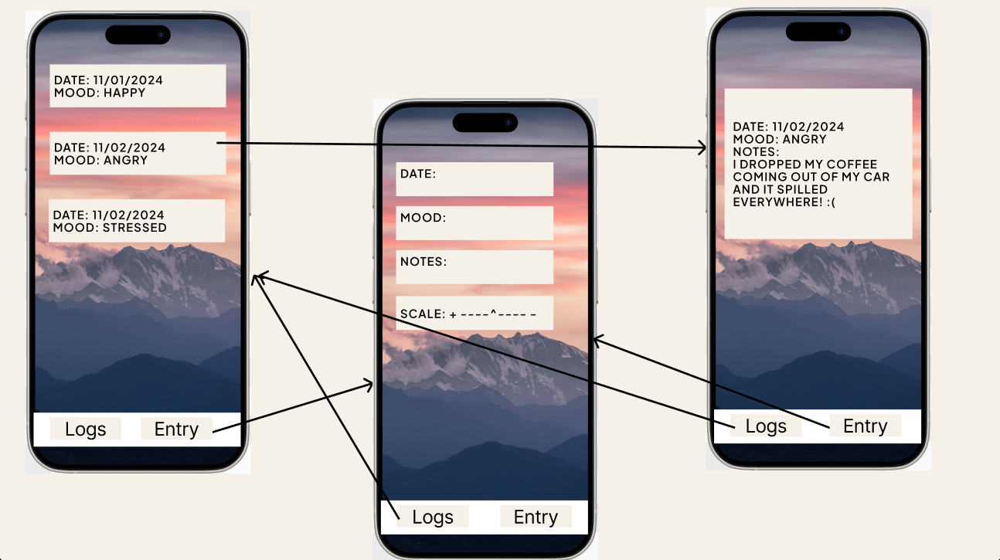
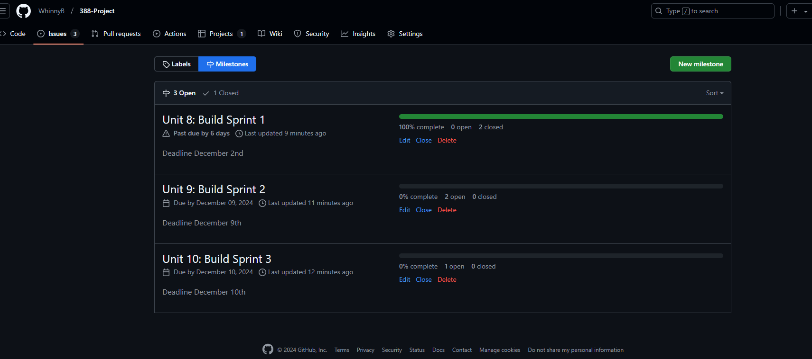
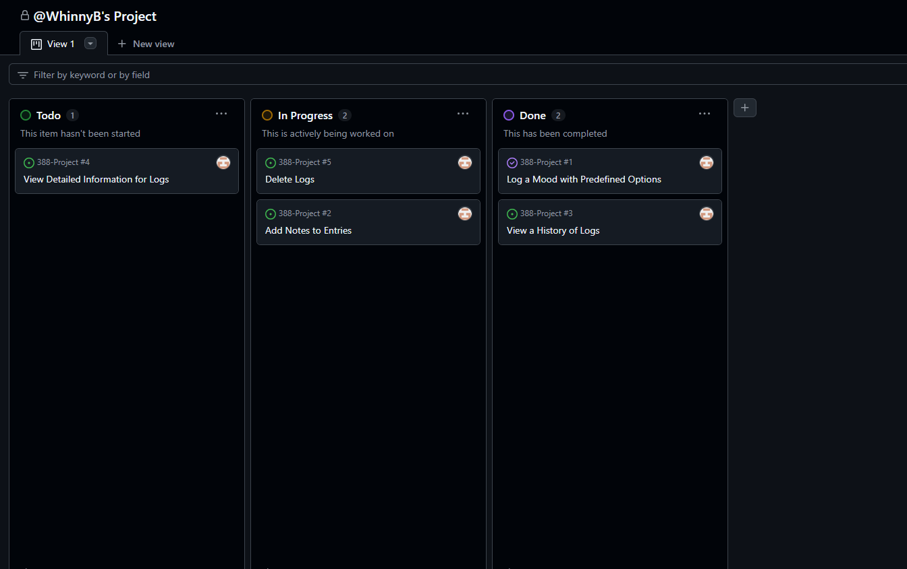
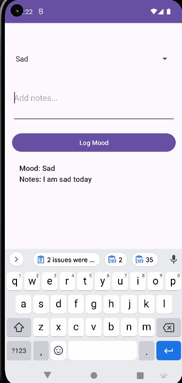
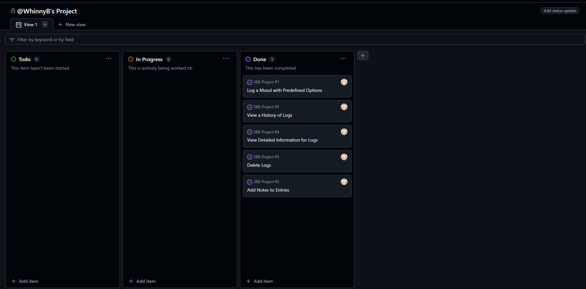
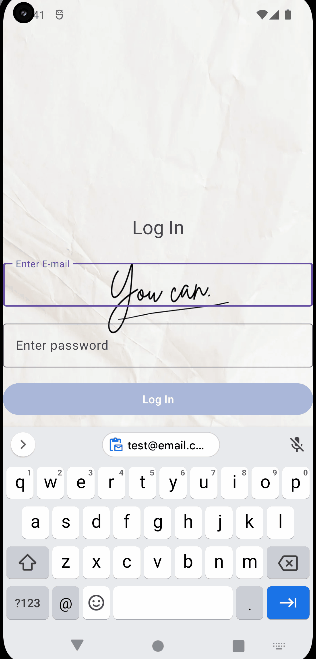

# Milestone 1 - Mood Log (Unit 7)

## Table of Contents

1. [Overview](#Overview)
1. [Product Spec](#Product-Spec)
1. [Wireframes](#Wireframes)

## Overview

### Description

Allows users to log their current mood throughout the day and write notes about the reasons why their emotions have been affected. Moods can be logged and stored in chronological order.

### App Evaluation

[Evaluation of your app across the following attributes]
- **Category:**  Health & Lifestyle
- **Mobile:** Mobile use allows the user to update their mood as it happens and whenever they feel their emotions. Having a mobile app makes it better to accurately log their moods.
- **Story:** Users are encouraged to tune in and reflect on their moods throughout the day. This will help them exercise self-reflection and awareness which can improve overall mood and mental health.
- **Market:** Anyone would would like to improve their mental/emotional health by practicing awareness.
- **Habit:** A few times a day depending how often the user's mood changes and how often they want to journal about their feelings.
- **Scope:** Medium difficulty app because I would like to implement notifications as well to "check-in" on the user and remind them to take a break from their day and log their moods. Other than that, the UI is simple and most of the app is simplified and can store information.

## Product Spec

### 1. User Features (Required and Optional)

**Required Features**

1. Log a mood with predefined options.
2. Add notes to entries.
3. View a history of logs in a scrollable list.
4. View detailed information for individual logs.
5. Delete logs.

**Optional Features**

1. Select multiple moods per entry.
2. Customize predefined mood options.

### 2. Screen Archetypes
- Home Screen
  - Log a mood and add notes.
  - Shortcut to Mood Log History.

- Mood Log History Screen
  - View a scrollable list of logs.
  - Navigate to Detailed Entry Screen.

- Detailed Entry Screen
  - View notes and details for a specific log.
  - Delete entry.

### 3. Navigation

### Tab Navigation (Tab to Screen)
* Home
* Mood Log History

### Flow Navigation (Screen to Screen)
- **Home Screen**
  - Navigate to Mood Log History Screen.
- **Mood Log History Screen**
  - Navigate to Detailed Entry Screen.
  - Return to Home Screen.
- **Detailed Entry Screen**
  - Return to Mood Log History Screen.

## Wireframes

 

 

### [BONUS] Digital Wireframes & Mockups

### [BONUS] Interactive Prototype

 

# Milestone 2 - Build Sprint 1 (Unit 8)

## GitHub Project board

## Issue cards

## Issues worked on this sprint

### Issue 1: Log a Mood with Predefined Options
- **Objective**: Allow the user to log their mood by selecting from a predefined list of mood options.
- **Implementation**:
  - Created a simple UI that displays predefined mood options.
  - Added functionality to log the selected mood into a list.
  - Stored the mood entries in a list that can be viewed later.

### Issue 2: Add Notes to Entries
- **Objective**: Enable the user to add notes alongside their mood entries.
- **Implementation**:
  - Added an input field for users to enter notes when logging their mood.
  - Integrated the note input with the mood log, so notes are stored along with the mood.
  - The notes are viewable with each mood log entry.

 

# Milestone 3 - Build Sprint 2 (Unit 9)

## GitHub Project board

## Completed user stories
- Users can log into their own account to log their moods.
- Users can log their mood using predefined options.
- Users can add and view notes alongside their mood entries.
- Mood entries and associated notes are displayed in an organized, visually appealing list.
- Integrated truncation for lengthy notes with an option to expand and view full details.
- Feature to edit or delete mood entries.

## App Demo Video

Click the thumbnail to watch the video on YouTube.

